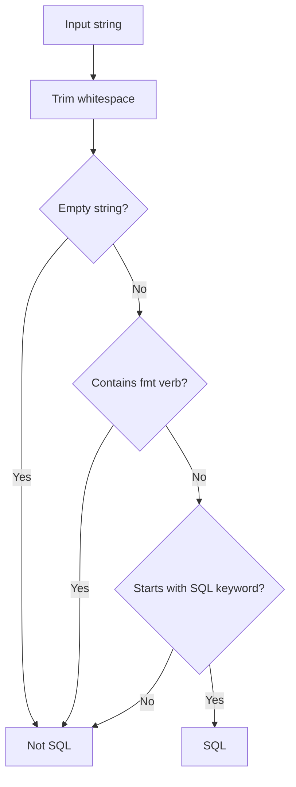

# SQL Detection Specification (MightBeSQL)

Heuristically determines whether a string extracted from a raw string literal is SQL.

## Detection Flow



## Detection Rules

Evaluated in the following order. The first matching condition determines the result.

1. Trim leading and trailing whitespace
2. Empty string → **Not SQL**
3. Contains `fmt` format verb → **Not SQL**
4. Starts with a SQL keyword → **SQL**
5. Otherwise → **Not SQL**

## fmt Format Verb Detection

Strings matching the following regex pattern are considered Go `fmt` templates and are not treated as SQL.

```
%[+\-# 0]*[*]?[0-9]*[.*]?[0-9]*[vTtbcdoOqxXUeEfFgGsp]
```

This excludes strings containing format verbs such as `%s`, `%d`, `%v`, `%02d`, `%-10s`, etc.

### Exclusion Example

```go
// fmt template — not a format target
tpl := `SELECT %s FROM %s WHERE id = %d`
```

## SQL Keyword Detection

The following regex pattern is used to detect a leading keyword (case-insensitive).

```
(?i)^\s*(SELECT|INSERT|UPDATE|DELETE)\b
```

### Target Keywords

| Keyword | Description |
|---------|-------------|
| `SELECT` | Data retrieval |
| `INSERT` | Data insertion |
| `UPDATE` | Data modification |
| `DELETE` | Data deletion |

Leading whitespace is allowed, but a word boundary (`\b`) is required after the keyword.

## Detection Result Examples

| Input | Result | Reason |
|-------|--------|--------|
| `select id from users` | SQL | Starts with `SELECT` |
| `INSERT INTO users (name) VALUES (?)` | SQL | Starts with `INSERT` |
| `update users set name = ?` | SQL | Starts with `UPDATE` (lowercase) |
| `delete from users where id = ?` | SQL | Starts with `DELETE` (lowercase) |
| `  SELECT id FROM users` | SQL | `SELECT` after leading whitespace |
| `SELECT %s FROM %s` | Not SQL | Contains fmt verb `%s` |
| `SELECT %d items` | Not SQL | Contains fmt verb `%d` |
| `hello world` | Not SQL | Does not start with a SQL keyword |
| `https://example.com/select/users` | Not SQL | Does not start with a SQL keyword |
| _(empty string)_ | Not SQL | Empty string |
| `CREATE TABLE users (...)` | Not SQL | `CREATE` is not a target keyword |

## Design Rationale

- **Minimize false positives**: Avoid misdetecting strings that resemble SQL, such as fmt templates and URLs
- **Lightweight pre-filter**: Reduce unnecessary input to the Vitess parser to maintain performance
- **Conservative detection**: Limit targets to 4 DML types (SELECT/INSERT/UPDATE/DELETE), excluding DDL and others
