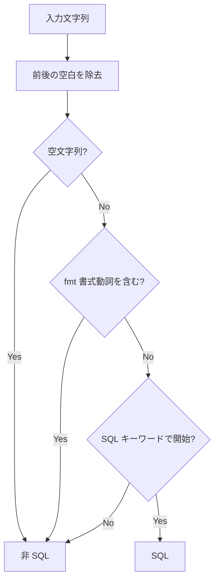

# SQL 検出仕様（MightBeSQL）

Raw string literal から抽出された文字列が SQL であるかをヒューリスティックに判定する。

## 判定フロー



## 判定条件

以下の順序で評価する。先に該当した条件で判定が確定する。

1. 前後の空白を除去する
2. 空文字列 → **非 SQL**
3. `fmt` の書式動詞を含む → **非 SQL**
4. 先頭が SQL キーワードで始まる → **SQL**
5. 上記以外 → **非 SQL**

## fmt 書式動詞の検出

以下の正規表現パターンに一致する文字列は、Go の `fmt` テンプレートとみなし SQL として扱わない。

```
%[+\-# 0]*[*]?[0-9]*[.*]?[0-9]*[vTtbcdoOqxXUeEfFgGsp]
```

これにより `%s`, `%d`, `%v`, `%02d`, `%-10s` 等の書式動詞を含む文字列を除外する。

### 除外例

```go
// fmt テンプレート — フォーマット対象外
tpl := `SELECT %s FROM %s WHERE id = %d`
```

## SQL キーワード判定

以下の正規表現パターンで先頭のキーワードを判定する（大文字小文字不問）。

```
(?i)^\s*(SELECT|INSERT|UPDATE|DELETE)\b
```

### 対象キーワード

| キーワード | 説明 |
|-----------|------|
| `SELECT` | データ取得 |
| `INSERT` | データ挿入 |
| `UPDATE` | データ更新 |
| `DELETE` | データ削除 |

先頭の空白は許容されるが、キーワードの後に単語境界（`\b`）が必要である。

## 判定結果の例

| 入力 | 判定 | 理由 |
|------|------|------|
| `select id from users` | SQL | `SELECT` で開始 |
| `INSERT INTO users (name) VALUES (?)` | SQL | `INSERT` で開始 |
| `update users set name = ?` | SQL | `UPDATE` で開始（小文字） |
| `delete from users where id = ?` | SQL | `DELETE` で開始（小文字） |
| `  SELECT id FROM users` | SQL | 先頭空白の後に `SELECT` |
| `SELECT %s FROM %s` | 非 SQL | fmt 書式動詞 `%s` を含む |
| `SELECT %d items` | 非 SQL | fmt 書式動詞 `%d` を含む |
| `hello world` | 非 SQL | SQL キーワードで開始しない |
| `https://example.com/select/users` | 非 SQL | SQL キーワードで開始しない |
| _(空文字列)_ | 非 SQL | 空文字列 |
| `CREATE TABLE users (...)` | 非 SQL | `CREATE` は対象キーワードでない |

## 設計意図

- **偽陽性の抑制**: fmt テンプレートや URL など、SQL に似た文字列を誤検出しないようにする
- **軽量な事前フィルタ**: Vitess パーサーへの不要な入力を減らし、パフォーマンスを維持する
- **保守的な判定**: 対象を DML 4 種（SELECT/INSERT/UPDATE/DELETE）に限定し、DDL 等は対象外とする
