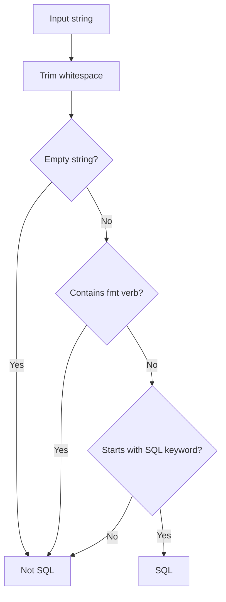

# SQL Detection Specification (MightBeSQL)

Heuristically determines whether a string extracted from a raw string literal is SQL. This is a lightweight pre-filter that runs before the Vitess SQL parser.

## Scope

Detection operates on the **content** of Go raw string literals (`ast.BasicLit` with backtick delimiters). Double-quoted strings are never candidates.

Given the following Go source:

```go
func example(db *sql.DB) {
	db.Exec(`select id from users where id = ?`, 1)
	db.Exec("select name from users", 1)
	msg := "hello world"
	_ = msg
	db.Query(`select * from orders`)
}
```

The Go AST contains these `*ast.BasicLit` (kind = `token.STRING`) nodes:

```
*ast.BasicLit {Value: "`select id from users where id = ?`"}   → raw string → candidate
*ast.BasicLit {Value: "\"select name from users\""}             → double-quoted → skipped
*ast.BasicLit {Value: "\"hello world\""}                        → double-quoted → skipped
*ast.BasicLit {Value: "`select * from orders`"}                 → raw string → candidate
```

Only the two raw string literals are extracted. Their inner content (with backticks stripped) is passed to `MightBeSQL`.

## Detection Flow



## Detection Rules

Evaluated in the following order. The first matching condition determines the result.

1. Trim leading and trailing whitespace
2. Empty string → **Not SQL**
3. Contains `fmt` format verb → **Not SQL**
4. Starts with a SQL keyword → **SQL**
5. Otherwise → **Not SQL**

## fmt Format Verb Detection

Strings matching the following regex pattern are considered Go `fmt` templates and are not treated as SQL.

```
%[+\-# 0]*[*]?[0-9]*[.*]?[0-9]*[vTtbcdoOqxXUeEfFgGsp]
```

This excludes strings containing format verbs such as `%s`, `%d`, `%v`, `%02d`, `%-10s`, etc.

### Example: fmt template excluded

**Go source:**

```go
tpl := `SELECT %s FROM %s WHERE id = %d`
```

**AST node:**

```
*ast.BasicLit {
    Kind:  token.STRING
    Value: "`SELECT %s FROM %s WHERE id = %d`"
}
```

Inner content after backtick stripping: `SELECT %s FROM %s WHERE id = %d`

`MightBeSQL` returns `false` because `%s` matches the fmt verb regex. Although the string starts with `SELECT`, it is a `fmt.Sprintf` template and should not be formatted as SQL.

## SQL Keyword Detection

The following regex pattern is used to detect a leading keyword (case-insensitive).

```
(?i)^\s*(SELECT|INSERT|UPDATE|DELETE)\b
```

### Target Keywords

| Keyword | Description |
|---------|-------------|
| `SELECT` | Data retrieval |
| `INSERT` | Data insertion |
| `UPDATE` | Data modification |
| `DELETE` | Data deletion |

Leading whitespace is allowed, but a word boundary (`\b`) is required after the keyword.

## Examples with Go AST Context

### Example 1: Simple SELECT (detected as SQL)

**Go source:**

```go
db.Exec(`select id from users where id = ?`, 1)
```

**AST (simplified):**

```
*ast.CallExpr {
    Fun: *ast.SelectorExpr {X: db, Sel: Exec}
    Args: [
        *ast.BasicLit {Kind: STRING, Value: "`select id from users where id = ?`"},
        *ast.BasicLit {Kind: INT, Value: "1"},
    ]
}
```

Inner content: `select id from users where id = ?`

- Trim → `select id from users where id = ?`
- Empty? → No
- fmt verb? → No
- SQL keyword prefix? → `select` matches `(?i)SELECT\b` → **SQL**

### Example 2: Double-quoted string (never reaches MightBeSQL)

**Go source:**

```go
db.Exec("select name from users", 1)
```

**AST:**

```
*ast.BasicLit {Kind: STRING, Value: "\"select name from users\""}
```

The scanner checks `isRawStringLit` first. Since the value starts with `"` (not `` ` ``), this literal is **skipped entirely** and never passed to `MightBeSQL`.

### Example 3: fmt template (detected as Not SQL)

**Go source:**

```go
query := fmt.Sprintf(`SELECT %s FROM %s WHERE id = %d`, cols, table, id)
```

**AST:**

```
*ast.CallExpr {
    Fun: *ast.SelectorExpr {X: fmt, Sel: Sprintf}
    Args: [
        *ast.BasicLit {Kind: STRING, Value: "`SELECT %s FROM %s WHERE id = %d`"},
        ...
    ]
}
```

Inner content: `SELECT %s FROM %s WHERE id = %d`

- Trim → `SELECT %s FROM %s WHERE id = %d`
- Empty? → No
- fmt verb? → `%s` matches → **Not SQL**

### Example 4: URL containing SQL keyword (detected as Not SQL)

**Go source:**

```go
url := `https://example.com/select/users`
```

**AST:**

```
*ast.BasicLit {Kind: STRING, Value: "`https://example.com/select/users`"}
```

Inner content: `https://example.com/select/users`

- Trim → `https://example.com/select/users`
- Empty? → No
- fmt verb? → No
- SQL keyword prefix? → starts with `https`, not a SQL keyword → **Not SQL**

### Example 5: Non-SQL plain text (detected as Not SQL)

**Go source:**

```go
msg := `failed to execute query`
```

Inner content: `failed to execute query`

- Trim → `failed to execute query`
- Empty? → No
- fmt verb? → No
- SQL keyword prefix? → starts with `failed`, not a SQL keyword → **Not SQL**

### Example 6: Leading whitespace (detected as SQL)

**Go source:**

```go
db.Query(`  SELECT id FROM users`)
```

Inner content: `  SELECT id FROM users`

- Trim → `SELECT id FROM users`
- Empty? → No
- fmt verb? → No
- SQL keyword prefix? → `SELECT` matches → **SQL**

## Detection Result Summary

| Input | Result | Reason |
|-------|--------|--------|
| `select id from users` | SQL | Starts with `SELECT` |
| `INSERT INTO users (name) VALUES (?)` | SQL | Starts with `INSERT` |
| `update users set name = ?` | SQL | Starts with `UPDATE` (lowercase) |
| `delete from users where id = ?` | SQL | Starts with `DELETE` (lowercase) |
| `  SELECT id FROM users` | SQL | `SELECT` after leading whitespace |
| `SELECT %s FROM %s` | Not SQL | Contains fmt verb `%s` |
| `SELECT * FROM users LIMIT %d` | Not SQL | Contains fmt verb `%d` |
| `hello world` | Not SQL | Does not start with a SQL keyword |
| `https://example.com/select/users` | Not SQL | Does not start with a SQL keyword |
| `the SELECT statement` | Not SQL | `SELECT` is not at the start |
| _(empty string)_ | Not SQL | Empty string |
| `CREATE TABLE users (...)` | Not SQL | `CREATE` is not a target keyword |

## Design Rationale

- **Minimize false positives**: Avoid misdetecting strings that resemble SQL, such as fmt templates and URLs
- **Lightweight pre-filter**: Reduce unnecessary input to the Vitess parser to maintain performance
- **Conservative detection**: Limit targets to 4 DML types (SELECT/INSERT/UPDATE/DELETE), excluding DDL and others
