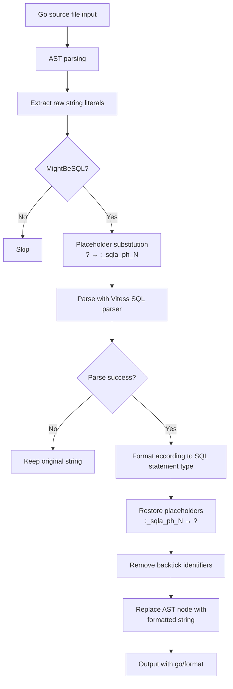
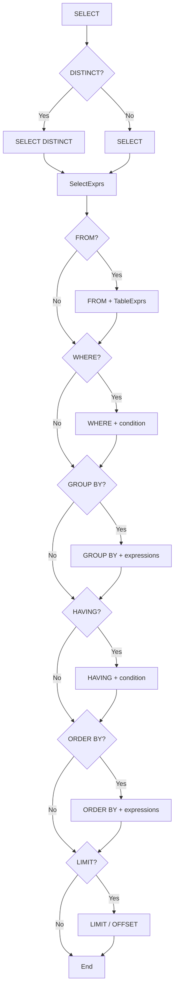

# Formatter Specification

Defines the specification for sanat's SQL formatter.

## Overview

sanat is a CLI tool that automatically formats SQL string literals embedded in Go source files. It detects SQL within raw string literals (backtick strings) and formats them in a consistent style.

## Processing Flow



## SQL Detection

See [detect-spec.md](detect-spec.md) for SQL detection rules.

## Format Targets

- Only **raw string literals** (backtick-quoted strings) in Go source files
- Double-quoted strings are excluded

```go
// Format target
db.Exec(`select id from users where id = ?`, 1)

// Not a format target (double-quoted)
db.Exec("select id from users where id = ?", 1)
```

## Placeholder Handling

Since the SQL parser cannot handle `?` correctly, substitution and restoration are performed before and after parsing.

1. **Substitution**: `?` → `:_sqla_ph_0`, `:_sqla_ph_1`, ... (indexed in order of appearance)
2. **Parsing**: Syntax analysis with the Vitess SQL parser
3. **Restoration**: `:_sqla_ph_N` → `?`

## Format Rules

### Common Rules

- SQL keywords are converted to **UPPERCASE**
- Each clause is placed on a **separate line**
- Clause contents are **indented** (default: 2 spaces)
- Backtick identifiers (MySQL style) are removed after formatting
- If parsing fails, the **original string is returned as-is**

### Keyword Uppercasing

The following keywords are uppercased during formatting:

`AS`, `ASC`, `DESC`, `AND`, `OR`, `NOT`, `IN`, `IS`, `LIKE`, `BETWEEN`, `EXISTS`, `NULL`, `TRUE`, `FALSE`, `ON`, `USING`

Clause keywords (`SELECT`, `FROM`, `WHERE`, etc.) are structurally output in uppercase.

### Indentation

```
depth * indent spaces
```

- `depth`: nesting depth (0-based)
- `indent`: indent width (default: 2)

Indentation increases with deeper nesting (e.g., subqueries).

## Statement Type Formatting

### SELECT



**Example output:**

```sql
SELECT
  u.id,
  u.name
FROM
  users u
WHERE
  u.status = ?
  AND u.active = TRUE
GROUP BY
  u.status
HAVING
  count(*) > 1
ORDER BY
  u.id DESC
LIMIT
  10
OFFSET
  20
```

### INSERT

```
INSERT INTO          -- or REPLACE INTO
  <table>
(                    -- column list (if present)
  <column1>,
  <column2>
)
VALUES               -- or SELECT subquery
  (<value1>, <value2>)
ON DUPLICATE KEY UPDATE  -- if present
  <expr1>,
  <expr2>
```

**Example output:**

```sql
INSERT INTO
  users
(
  name,
  email
)
VALUES
  (?, ?)
ON DUPLICATE KEY UPDATE
  name = values(name),
  email = values(email)
```

### UPDATE

```
UPDATE
  <table>
SET
  <expr1>,
  <expr2>
WHERE              -- if present
  <condition>
ORDER BY           -- if present
  <expression>
LIMIT              -- if present
  <value>
```

**Example output:**

```sql
UPDATE
  users
SET
  name = ?,
  email = ?
WHERE
  id = ?
```

### DELETE

```
DELETE FROM
  <table>
WHERE              -- if present
  <condition>
ORDER BY           -- if present
  <expression>
LIMIT              -- if present
  <value>
```

**Example output:**

```sql
DELETE FROM
  users
WHERE
  id = ?
```

### UNION / UNION ALL

Formats the left and right SELECT statements independently and joins them with `UNION` or `UNION ALL`.

**Example output:**

```sql
SELECT
  id
FROM
  users
UNION ALL
SELECT
  id
FROM
  admins
```

## Expression Formatting

### WHERE Clause Conditions

- Conditions joined with `AND` are expanded to separate lines
- Conditions joined with `OR` are also expanded to separate lines
- The first condition has no prefix; subsequent conditions are prefixed with `AND` / `OR`

```sql
WHERE
  u.status = ?
  AND u.active = TRUE
  OR u.role = 'admin'
```

### Table Expressions

#### Simple Table

```sql
FROM
  users u
```

#### JOIN

Expands the left and right sides of the JOIN, with the `ON` condition at additional indentation.

```sql
FROM
  users u
  JOIN
  orders o
    ON u.id = o.user_id
```

#### Derived Table (Subquery)

Wraps the subquery in parentheses and formats the interior with nested indentation.

```sql
FROM
  (
  SELECT
    id
  FROM
    users
  ) t
```

### Subquery Expressions

#### EXISTS

```sql
WHERE
  EXISTS (
    SELECT
      1
    FROM
      orders o
    WHERE
      o.user_id = u.id
  )
```

#### Scalar Subquery

```sql
  (
    SELECT
      count(*)
    FROM
      orders
  )
```

### SELECT Expressions

- Each column is placed on a separate line
- Aliases are connected with `AS`
- Wildcard `*` and table-qualified `t.*` are supported

```sql
SELECT
  u.id,
  u.name AS user_name,
  count(*) AS cnt
```

## Configuration

### Configuration File

Configuration files are searched in the following order (first match is used):

1. `.sanat.yml`
2. `.sanat.yaml`
3. `.sanat.toml`

### Configuration Options

| Option | Type | Default | Description |
|--------|------|---------|-------------|
| `write` | bool | `false` | Whether to overwrite files |
| `indent` | int | `2` | SQL indent width (number of spaces) |
| `newline` | bool | `true` | Whether to insert a newline after the opening backtick |

### Configuration Examples

**YAML:**

```yaml
write: true
indent: 4
newline: true
```

**TOML:**

```toml
write = true
indent = 4
newline = true
```

### Precedence

CLI flags > configuration file > default values

When a flag is explicitly specified, it takes precedence over the configuration file value.

## CLI

### Usage

```
sanat [flags] [pattern ...]
```

### Flags

| Flag | Short | Default | Description |
|------|-------|---------|-------------|
| `--write` | `-w` | `false` | Overwrite files |
| `--indent` | | `2` | SQL indent width |
| `--newline` | | `true` | Newline after opening backtick |
| `--config` | `-c` | | Configuration file path |

### Input Methods

- **File patterns**: `sanat file.go`, `sanat ./...`, `sanat *.go`
- **Standard input**: `cat file.go | sanat`

### Pattern Resolution

- `./...` — recursively traverse directories
- Directory path — traverse `.go` files within the directory
- Glob pattern — target matching `.go` files

### Excluded Directories

The following directories are excluded from traversal:

- `vendor/`
- `.git/`
- `testdata/`

### Output

- Default: output formatted result to stdout
- With `-w`: overwrite files directly (permission 0600)

## Newline Option

When the `newline` option is `true` (default), newlines are inserted before and after the formatted SQL.

**newline: true:**

```go
db.Exec(`
SELECT
  id
FROM
  users
`, 1)
```

**newline: false:**

```go
db.Exec(`SELECT
  id
FROM
  users`, 1)
```

## Parser

The [Vitess](https://vitess.io/) SQL parser (`vitess.io/vitess/go/vt/sqlparser`) is used for SQL syntax analysis. It supports MySQL-compatible SQL syntax.

### Supported SQL Statements

| Statement Type | Supported |
|---------------|-----------|
| SELECT | o |
| INSERT | o |
| REPLACE | o |
| UPDATE | o |
| DELETE | o |
| UNION / UNION ALL | o |
| Other | Falls back to Vitess default output |
