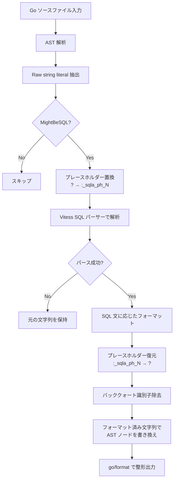
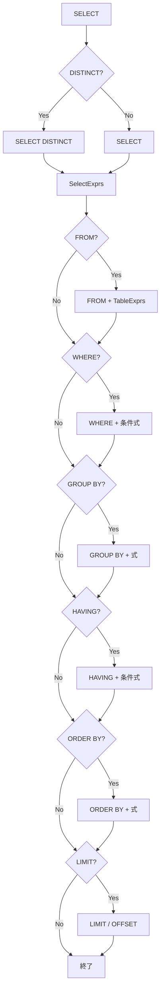

# Formatter Specification

sanat の SQL フォーマッターの仕様を定義する。

## 概要

sanat は Go ソースファイルに埋め込まれた SQL 文字列リテラルを自動整形する CLI ツールである。Raw string literal（バッククォート文字列）内の SQL を検出し、一貫したスタイルでフォーマットする。

## 処理フロー



## SQL 検出

SQL 検出ルールの詳細は [detect-spec.md](detect-spec.md) を参照。

## フォーマット対象

- Go ソースファイル内の **Raw string literal**（バッククォートで囲まれた文字列）のみ
- ダブルクォート文字列は対象外

```go
// フォーマット対象
db.Exec(`select id from users where id = ?`, 1)

// フォーマット対象外（ダブルクォート）
db.Exec("select id from users where id = ?", 1)
```

## プレースホルダー処理

SQL パーサーが `?` を正しく処理できないため、パース前後で置換・復元を行う。

1. **置換**: `?` → `:_sqla_ph_0`, `:_sqla_ph_1`, ... （出現順にインデックス付与）
2. **パース**: Vitess SQL パーサーで構文解析
3. **復元**: `:_sqla_ph_N` → `?` に戻す

## フォーマットルール

### 共通ルール

- SQL キーワードは **大文字** に変換する
- 各句（clause）は **独立した行** に配置する
- 句の内容は **インデント** して記述する（デフォルト: スペース 2 文字）
- バッククォート識別子（MySQL 形式）はフォーマット後に除去する
- パースに失敗した場合は **元の文字列をそのまま返す**

### キーワード大文字化

以下のキーワードがフォーマット時に大文字に変換される:

`AS`, `ASC`, `DESC`, `AND`, `OR`, `NOT`, `IN`, `IS`, `LIKE`, `BETWEEN`, `EXISTS`, `NULL`, `TRUE`, `FALSE`, `ON`, `USING`

句のキーワード（`SELECT`, `FROM`, `WHERE` 等）は構造的に大文字で出力される。

### インデント

```
depth * indent 文字のスペース
```

- `depth`: ネストの深さ（0 始まり）
- `indent`: インデント幅（デフォルト: 2）

ネストが深くなるほど（サブクエリ等）インデントが増える。

## 文タイプ別フォーマット

### SELECT



**出力例:**

```sql
SELECT
  u.id,
  u.name
FROM
  users u
WHERE
  u.status = ?
  AND u.active = TRUE
GROUP BY
  u.status
HAVING
  count(*) > 1
ORDER BY
  u.id DESC
LIMIT
  10
OFFSET
  20
```

### INSERT

```
INSERT INTO          -- または REPLACE INTO
  <テーブル名>
(                    -- カラムリスト（存在する場合）
  <カラム1>,
  <カラム2>
)
VALUES               -- または SELECT サブクエリ
  (<値1>, <値2>)
ON DUPLICATE KEY UPDATE  -- 存在する場合
  <式1>,
  <式2>
```

**出力例:**

```sql
INSERT INTO
  users
(
  name,
  email
)
VALUES
  (?, ?)
ON DUPLICATE KEY UPDATE
  name = values(name),
  email = values(email)
```

### UPDATE

```
UPDATE
  <テーブル>
SET
  <式1>,
  <式2>
WHERE              -- 存在する場合
  <条件>
ORDER BY           -- 存在する場合
  <式>
LIMIT              -- 存在する場合
  <値>
```

**出力例:**

```sql
UPDATE
  users
SET
  name = ?,
  email = ?
WHERE
  id = ?
```

### DELETE

```
DELETE FROM
  <テーブル>
WHERE              -- 存在する場合
  <条件>
ORDER BY           -- 存在する場合
  <式>
LIMIT              -- 存在する場合
  <値>
```

**出力例:**

```sql
DELETE FROM
  users
WHERE
  id = ?
```

### UNION / UNION ALL

左辺と右辺の SELECT をそれぞれフォーマットし、`UNION` または `UNION ALL` で接続する。

**出力例:**

```sql
SELECT
  id
FROM
  users
UNION ALL
SELECT
  id
FROM
  admins
```

## 式のフォーマット

### WHERE 句の条件式

- `AND` で結合された条件は各行に展開する
- `OR` で結合された条件も各行に展開する
- 最初の条件にはプレフィックスなし、2 番目以降は `AND` / `OR` を付与する

```sql
WHERE
  u.status = ?
  AND u.active = TRUE
  OR u.role = 'admin'
```

### テーブル式

#### 通常のテーブル

```sql
FROM
  users u
```

#### JOIN

JOIN の左辺・右辺をそれぞれ展開し、`ON` 条件を追加インデントで記述する。

```sql
FROM
  users u
  JOIN
  orders o
    ON u.id = o.user_id
```

#### 派生テーブル（サブクエリ）

サブクエリを括弧で囲み、内部をネストしたインデントでフォーマットする。

```sql
FROM
  (
  SELECT
    id
  FROM
    users
  ) t
```

### サブクエリ式

#### EXISTS

```sql
WHERE
  EXISTS (
    SELECT
      1
    FROM
      orders o
    WHERE
      o.user_id = u.id
  )
```

#### スカラーサブクエリ

```sql
  (
    SELECT
      count(*)
    FROM
      orders
  )
```

### SELECT 式

- 各カラムを独立した行に配置する
- エイリアスは `AS` で接続する
- ワイルドカード `*` やテーブル修飾 `t.*` をサポートする

```sql
SELECT
  u.id,
  u.name AS user_name,
  count(*) AS cnt
```

## 設定

### 設定ファイル

以下の順序で設定ファイルを探索する（最初に見つかったものを使用）:

1. `.sanat.yml`
2. `.sanat.yaml`
3. `.sanat.toml`

### 設定項目

| 項目 | 型 | デフォルト | 説明 |
|------|----|-----------|------|
| `write` | bool | `false` | ファイルを上書きするか |
| `indent` | int | `2` | SQL インデント幅（スペース数） |
| `newline` | bool | `true` | 開きバッククォートの後に改行を挿入するか |

### 設定例

**YAML:**

```yaml
write: true
indent: 4
newline: true
```

**TOML:**

```toml
write = true
indent = 4
newline = true
```

### 優先順位

CLI フラグ > 設定ファイル > デフォルト値

明示的にフラグが指定された場合、設定ファイルの値より優先される。

## CLI

### 使用方法

```
sanat [flags] [pattern ...]
```

### フラグ

| フラグ | 短縮 | デフォルト | 説明 |
|--------|------|-----------|------|
| `--write` | `-w` | `false` | ファイルを上書き |
| `--indent` | | `2` | SQL インデント幅 |
| `--newline` | | `true` | 開きバッククォート後の改行 |
| `--config` | `-c` | | 設定ファイルパス |

### 入力方法

- **ファイルパターン**: `sanat file.go`, `sanat ./...`, `sanat *.go`
- **標準入力**: `cat file.go | sanat`

### パターン解決

- `./...` — 再帰的にディレクトリを走査
- ディレクトリ指定 — そのディレクトリ内の `.go` ファイルを走査
- glob パターン — マッチする `.go` ファイルを対象

### 除外ディレクトリ

以下のディレクトリは走査から除外される:

- `vendor/`
- `.git/`
- `testdata/`

### 出力

- デフォルト: フォーマット結果を標準出力に出力
- `-w` 指定時: ファイルを直接上書き（パーミッション 0600）

## Newline オプション

`newline` オプションが `true`（デフォルト）の場合、フォーマット済み SQL の前後に改行を挿入する。

**newline: true:**

```go
db.Exec(`
SELECT
  id
FROM
  users
`, 1)
```

**newline: false:**

```go
db.Exec(`SELECT
  id
FROM
  users`, 1)
```

## パーサー

SQL の構文解析には [Vitess](https://vitess.io/) の SQL パーサー（`vitess.io/vitess/go/vt/sqlparser`）を使用する。MySQL 互換の SQL 構文をサポートする。

### 対応する SQL 文

| 文タイプ | 対応 |
|----------|------|
| SELECT | o |
| INSERT | o |
| REPLACE | o |
| UPDATE | o |
| DELETE | o |
| UNION / UNION ALL | o |
| その他 | Vitess のデフォルト出力にフォールバック |
