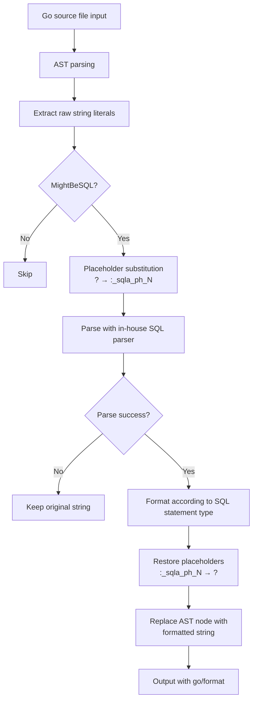
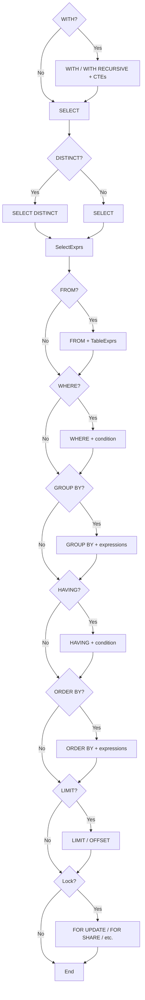

# Formatter Specification

Defines the specification for sanat's SQL formatter.

## Overview

sanat is a CLI tool that automatically formats SQL string literals embedded in Go source files. It detects SQL within raw string literals (backtick strings) and formats them in a consistent style.

## Processing Flow


```mermaid
flowchart TD
    A[Go source file input] --> B[AST parsing]
    B --> C[Extract raw string literals]
    C --> D{MightBeSQL?}
    D -- No --> E[Skip]
    D -- Yes --> F[Placeholder substitution<br/>? → :_sqla_ph_N]
    F --> G[Parse with in-house SQL parser]
    G --> H{Parse success?}
    H -- No --> I[Keep original string]
    H -- Yes --> J[Format according to SQL statement type]
    J --> K[Restore placeholders<br/>:_sqla_ph_N → ?]
    K --> M[Replace AST node with<br/>formatted string]
    M --> N[Output with go/format]
```

## SQL Detection

See [detect-spec.md](detect-spec.md) for SQL detection rules.

## Format Targets

- Only **raw string literals** (backtick-quoted strings) in Go source files
- Double-quoted strings are excluded

```go
// Format target
db.Exec(`select id from users where id = ?`, 1)

// Not a format target (double-quoted)
db.Exec("select id from users where id = ?", 1)
```

## Placeholder Handling

Since the SQL parser cannot handle `?` correctly, substitution and restoration are performed before and after parsing.

1. **Substitution**: `?` → `:_sqla_ph_0`, `:_sqla_ph_1`, ... (indexed in order of appearance)
2. **Parsing**: Syntax analysis with the in-house SQL parser (see [parser-spec.md](parser-spec.md))
3. **Restoration**: `:_sqla_ph_N` → `?`

## Format Rules

### Common Rules

- Clause keywords and aggregate/window function names are converted to **UPPERCASE**; operator/predicate keywords follow the [`keyword_case`](#keyword-casing) option instead
- Each clause is placed on a **separate line**
- Clause contents are **indented** (default: 2 spaces)
- Backtick-quoted identifiers (MySQL style) are parsed and re-rendered unquoted
- If parsing fails, the **original string is returned as-is**

### Keyword Casing

sanat renders three distinct categories of "keyword-shaped" text:

- **Clause keywords** — `SELECT`, `FROM`, `WHERE`, `WITH`, `INSERT`, `UPDATE`, `DELETE`, `UNION`, `CASE`/`WHEN`/`THEN`/`ELSE`/`END`, `VALUES`, `SET`, and similar. These are emitted as hardcoded literals and are **always uppercase**, regardless of the `keyword_case` option.
- **Operator/predicate keywords** — `AS`, `ASC`, `DESC`, `AND`, `OR`, `NOT`, `IN`, `IS`, `LIKE`, `BETWEEN`, `EXISTS`, `NULL`, `TRUE`, `FALSE`, `ON`, `USING`. Casing for these is controlled by the [`keyword_case`](#configuration-options) option (default: `upper`).
- **Aggregate/window function names** — `COUNT`, `SUM`, `AVG`, and similar. These are always uppercase and are not affected by `keyword_case`.

**`keyword_case` values:**

| Value | Behavior |
|-------|----------|
| `upper` (default) | Operator/predicate keywords are uppercased |
| `lower` | Operator/predicate keywords are lowercased |
| `preserve` | Operator/predicate keywords are left as emitted by the parser |

> **Note:** sanat parses SQL with its in-house parser (see [Parser](#parser)), which does not retain the source's original keyword casing for operator/predicate keywords either — these tokens are canonicalized to uppercase while parsing, regardless of how they were written in the source. As a result, `preserve` currently behaves the same as `upper` (the parser's canonical output). True preservation of the source's original casing would require the parser to retain each keyword token's original literal text, which it does not currently do.

### Indentation

```
depth * indent spaces
```

- `depth`: nesting depth (0-based)
- `indent`: indent width (default: 2)

Indentation increases with deeper nesting (e.g., subqueries).

## Statement Type Formatting

### SELECT


```mermaid
flowchart TD
    W0{WITH?} -- Yes --> CTE[WITH / WITH RECURSIVE + CTEs]
    W0 -- No --> S
    CTE --> S[SELECT]
    S --> D{DISTINCT?}
    D -- Yes --> D1["SELECT DISTINCT"]
    D -- No --> D2["SELECT"]
    D1 --> SE[SelectExprs]
    D2 --> SE
    SE --> F{FROM?}
    F -- Yes --> FE[FROM + TableExprs]
    F -- No --> W
    FE --> W{WHERE?}
    W -- Yes --> WE[WHERE + condition]
    W -- No --> G
    WE --> G{GROUP BY?}
    G -- Yes --> GE[GROUP BY + expressions]
    G -- No --> H
    GE --> H{HAVING?}
    H -- Yes --> HE[HAVING + condition]
    H -- No --> O
    HE --> O{ORDER BY?}
    O -- Yes --> OE[ORDER BY + expressions]
    O -- No --> L
    OE --> L{LIMIT?}
    L -- Yes --> LE[LIMIT / OFFSET]
    L -- No --> LK
    LE --> LK{Lock?}
    LK -- Yes --> LKE[FOR UPDATE / FOR SHARE / etc.]
    LK -- No --> END[End]
    LKE --> END
```

**Example output:**

```sql
SELECT
  u.id,
  u.name
FROM
  users u
WHERE
  u.status = ?
  AND u.active = TRUE
GROUP BY
  u.status
HAVING
  COUNT(*) > 1
ORDER BY
  u.id DESC
LIMIT
  10
OFFSET
  20
```

### INSERT

```
INSERT INTO          -- or REPLACE INTO, INSERT IGNORE INTO
  <table>
(                    -- column list (if present)
  <column1>,
  <column2>
)
VALUES               -- or SELECT subquery
  (<value1>, <value2>)
ON DUPLICATE KEY UPDATE  -- if present
  <expr1>,
  <expr2>
```

The `IGNORE` modifier is supported: `INSERT IGNORE INTO`.

**Example output:**

```sql
INSERT INTO
  users
(
  name,
  email
)
VALUES
  (?, ?)
ON DUPLICATE KEY UPDATE
  name = values(name),
  email = values(email)
```

```sql
INSERT IGNORE INTO
  users
(
  name
)
VALUES
  (?)
```

### UPDATE

```
UPDATE               -- or UPDATE IGNORE
  <table>
SET
  <expr1>,
  <expr2>
WHERE              -- if present
  <condition>
ORDER BY           -- if present
  <expression>
LIMIT              -- if present
  <value>
```

The `IGNORE` modifier and `WITH` clause (CTE) are supported. Multi-table UPDATE with JOIN is also supported.

**Example output:**

```sql
UPDATE
  users
SET
  name = ?,
  email = ?
WHERE
  id = ?
```

### DELETE

```
DELETE FROM           -- single-table, or DELETE IGNORE FROM
  <table>
WHERE              -- if present
  <condition>
ORDER BY           -- if present
  <expression>
LIMIT              -- if present
  <value>
```

Multi-table DELETE uses a separate target list:

```
DELETE
  <target1>,
  <target2>
FROM
  <table_exprs>
WHERE
  <condition>
```

The `IGNORE` modifier and `WITH` clause (CTE) are supported.

**Example output:**

```sql
DELETE FROM
  users
WHERE
  id = ?
```

```sql
DELETE
  t1,
  t2
FROM
  t1
  JOIN
  t2
    ON t1.id = t2.ref_id
WHERE
  t2.status = ?
```

### UNION / UNION ALL

Formats the left and right SELECT statements independently and joins them with `UNION` or `UNION ALL`. The `WITH` clause (CTE) and locking clauses are supported.

**Example output:**

```sql
SELECT
  id
FROM
  users
UNION ALL
SELECT
  id
FROM
  admins
```

### DDL Statements

`CREATE TABLE`'s column/constraint list and `CREATE INDEX`'s column list
follow the same rule as every other bracketed list in this formatter (see
the INSERT column list above): one element per line, indented, even when
there's only one. `ALTER TABLE`'s action list follows the same rule as
`UPDATE`'s `SET` list: one action per line, even for a single action.
Trailing table options (`ENGINE`, `DEFAULT CHARSET`, ...) stay on the
closing paren's line rather than being broken out, since they're key/value
modifiers rather than a SQL clause with sub-structure.

```
CREATE TABLE                 -- optionally IF NOT EXISTS
  <table> (
  <column_or_constraint1>,
  <column_or_constraint2>
) <option1> <option2>        -- if present, e.g. ENGINE=InnoDB

ALTER TABLE
  <table>
  <action1>,
  <action2>

CREATE INDEX                 -- optionally UNIQUE
  <index> ON <table>
(
  <column1>,
  <column2>
)

DROP INDEX <index> ON <table>

DROP TABLE                   -- optionally IF EXISTS
  <table1>, <table2>

TRUNCATE TABLE <table>
```

**Example output:**

```sql
CREATE TABLE IF NOT EXISTS users (
  id INT NOT NULL AUTO_INCREMENT,
  email VARCHAR(255) NOT NULL,
  PRIMARY KEY (id),
  UNIQUE KEY uq_email (email)
) ENGINE=InnoDB DEFAULT CHARSET=utf8mb4
```

```sql
ALTER TABLE users
  ADD COLUMN age INT,
  DROP COLUMN legacy_flag
```

Data type names (`INT`, `varchar`, ...) are not canonicalized to a fixed
case — like an unrecognized function name, a type name's casing is
preserved exactly as written in the source, since `sqlast.DataType` models
MySQL's type vocabulary generically rather than as a fixed enum (see
[parser-spec.md](parser-spec.md#ddl-statement-grammar)). Every other
DDL keyword (`CREATE`, `TABLE`, `ADD`, `PRIMARY KEY`, `NOT NULL`,
`AUTO_INCREMENT`, `ENGINE`, ...) is a clause keyword and therefore always
uppercase, unaffected by `keyword_case`, the same treatment `SELECT`/`FROM`
already get.

## Expression Formatting

### WHERE Clause Conditions

- Conditions joined with `AND` are expanded to separate lines
- Conditions joined with `OR` are also expanded to separate lines
- The first condition has no prefix; subsequent conditions are prefixed with `AND` / `OR`

```sql
WHERE
  u.status = ?
  AND u.active = TRUE
  OR u.role = 'admin'
```

### Table Expressions

#### Simple Table

```sql
FROM
  users u
```

#### JOIN

Expands the left and right sides of the JOIN, with the `ON` condition at additional indentation.

```sql
FROM
  users u
  JOIN
  orders o
    ON u.id = o.user_id
```

#### Index Hints

Index hints (`USE INDEX`, `FORCE INDEX`, `IGNORE INDEX`) are appended after the table name/alias on the same line.

```sql
FROM
  users USE INDEX (idx_name)
```

```sql
FROM
  users FORCE INDEX (idx_created)
```

The optional `FOR` clause (`FOR JOIN`, `FOR ORDER BY`, `FOR GROUP BY`) is also supported.

#### Derived Table (Subquery)

Wraps the subquery in parentheses and formats the interior with nested indentation.

```sql
FROM
  (
  SELECT
    id
  FROM
    users
  ) t
```

### Subquery Expressions

#### EXISTS

```sql
WHERE
  EXISTS (
    SELECT
      1
    FROM
      orders o
    WHERE
      o.user_id = u.id
  )
```

#### Scalar Subquery

```sql
  (
    SELECT
      COUNT(*)
    FROM
      orders
  )
```

### NOT Expression

The `NOT` prefix is preserved in front of any expression.

```sql
WHERE
  NOT status = 'deleted'
```

```sql
WHERE
  NOT EXISTS (
    SELECT
      1
    FROM
      banned
    WHERE
      banned.user_id = users.id
  )
```

### CASE Expression

CASE expressions are formatted with WHEN/ELSE clauses indented one level deeper than CASE/END.

**Searched CASE (no expression):**

```sql
  CASE
    WHEN status = 1 THEN 'active'
    WHEN status = 2 THEN 'inactive'
    ELSE 'unknown'
  END
```

**Simple CASE (with expression):**

```sql
  CASE status
    WHEN 1 THEN 'active'
    WHEN 2 THEN 'inactive'
  END
```

### Window Functions (OVER Clause)

Aggregate and window functions with OVER clauses are formatted with the window specification on multiple lines.

**Inline window specification:**

```sql
SELECT
  SUM(amount) OVER (
    PARTITION BY user_id
    ORDER BY created_at
  )
FROM
  orders
```

**Named window reference:**

```sql
SELECT
  SUM(amount) OVER w
FROM
  orders
```

Supported function types: COUNT, COUNT(*), SUM, AVG, MIN, MAX, BIT_AND, BIT_OR, BIT_XOR, STD, STDDEV, STDDEV_POP, STDDEV_SAMP, VAR_POP, VAR_SAMP, VARIANCE, ROW_NUMBER, RANK, DENSE_RANK, PERCENT_RANK, CUME_DIST, FIRST_VALUE, LAST_VALUE, NTILE, NTH_VALUE, LAG, LEAD, JSON_ARRAYAGG, JSON_OBJECTAGG. These aggregate/window names always render uppercase regardless of the source casing; a generic (non-aggregate) function call preserves whatever casing it was written with.

### SELECT Expressions

- Each column is placed on a separate line
- Aliases are connected with `AS`
- Wildcard `*` and table-qualified `t.*` are supported

```sql
SELECT
  u.id,
  u.name AS user_name,
  COUNT(*) AS cnt
```

### Comma Style

The `comma_style` option controls comma placement in every rendered list (`SELECT` columns, `INSERT` columns/values, `SET` assignments, `GROUP BY`/`ORDER BY` expressions, CTE definitions, and similar).

| Value | Behavior |
|-------|----------|
| `trailing` (default) | Each item except the last ends with a comma |
| `leading` | Each item except the first starts with a comma |

**`trailing` (default):**

```sql
SELECT
  id,
  name,
  email
FROM
  users
```

**`leading`:**

```sql
SELECT
  id
, name
, email
FROM
  users
```

### Locking Clauses

Locking clauses are placed on their own line after LIMIT (or after the last clause if no LIMIT). Supported clauses: `FOR UPDATE`, `FOR SHARE`, `LOCK IN SHARE MODE`, `FOR UPDATE SKIP LOCKED`, `FOR UPDATE NOWAIT`, `FOR SHARE SKIP LOCKED`, `FOR SHARE NOWAIT`.

```sql
SELECT
  *
FROM
  users
FOR UPDATE
```

```sql
SELECT
  *
FROM
  users
FOR UPDATE SKIP LOCKED
```

### WITH Clause (Common Table Expressions)

CTE definitions appear before the main statement. Each CTE subquery is indented. Supported on SELECT, UNION, UPDATE, and DELETE statements.

```sql
WITH
  cte AS (
    SELECT
      id
    FROM
      users
  )
SELECT
  *
FROM
  cte
```

**Multiple CTEs:**

```sql
WITH
  a AS (
    ...
  ),
  b AS (
    ...
  )
SELECT
  *
FROM
  a, b
```

**RECURSIVE CTE:**

```sql
WITH RECURSIVE
  cte AS (
    SELECT
      1 AS id
    UNION ALL
    SELECT
      id + 1
    FROM
      cte
    WHERE
      id < 10
  )
SELECT
  *
FROM
  cte
```

**CTE with column list:**

```sql
WITH
  cte (id, name) AS (
    SELECT
      id,
      name
    FROM
      users
  )
SELECT
  *
FROM
  cte
```

## Configuration

### Configuration File

Configuration files are searched in the following order (first match is used):

1. `.sanat.yml`
2. `.sanat.yaml`
3. `.sanat.toml`

### Configuration Options

| Option | Type | Required | Default | Description |
|--------|------|----------|---------|-------------|
| `version` | int | no | — | Config schema version. Currently only `1` is supported. See [Config Versioning](#config-versioning). |
| `write` | bool | no | `false` | Whether to overwrite files |
| `indent` | int (> 0) | no | `2` | SQL indent width (number of spaces) |
| `newline` | bool | no | `true` | Whether to insert a newline after the opening backtick |
| `keyword_case` | `upper` \| `lower` \| `preserve` | no | `upper` | Casing for operator/predicate keywords. See [Keyword Casing](#keyword-casing). |
| `comma_style` | `trailing` \| `leading` | no | `trailing` | Comma placement in rendered lists. See [Comma Style](#comma-style). |

### Configuration Examples

**YAML:**

```yaml
version: 1
write: true
indent: 4
newline: true
keyword_case: upper
comma_style: trailing
```

**TOML:**

```toml
version = 1
write = true
indent = 4
newline = true
keyword_case = "upper"
comma_style = "trailing"
```

### Config Versioning

The `version` field declares which config schema a file was written against, so sanat can evolve the schema safely:

- If `version` is present but not a version sanat supports, loading the config **fails with an error**.
- If `version` is absent, the config is treated as version 0 (pre-schema): sanat still loads it and applies defaults, but prints a deprecation warning to stderr suggesting `version = 1` be added.

Unrecognized fields in the config file do not fail loading; sanat prints a warning to stderr for each one, to help catch typos while remaining forward-compatible with newer config files read by older sanat versions.

### Precedence

CLI flags > configuration file > default values

When a flag is explicitly specified, it takes precedence over the configuration file value.

## CLI

### Usage

```
sanat [flags] [pattern ...]
```

### Flags

| Flag | Short | Default | Description |
|------|-------|---------|-------------|
| `--write` | `-w` | `false` | Overwrite files |
| `--indent` | | `2` | SQL indent width |
| `--newline` | | `true` | Newline after opening backtick |
| `--keyword-case` | | `upper` | Casing for operator/predicate keywords (`upper`, `lower`, `preserve`) |
| `--comma-style` | | `trailing` | Comma placement in lists (`trailing`, `leading`) |
| `--config` | `-c` | | Configuration file path |

### Input Methods

- **File patterns**: `sanat file.go`, `sanat ./...`, `sanat *.go`
- **Standard input**: `cat file.go | sanat`

### Pattern Resolution

- `./...` — recursively traverse directories
- Directory path — traverse `.go` files within the directory
- Glob pattern — target matching `.go` files

### Excluded Directories

The following directories are excluded from traversal:

- `vendor/`
- `.git/`
- `testdata/`

### Output

- Default: output formatted result to stdout
- With `-w`: overwrite files directly (permission 0600)

## Newline Option

When the `newline` option is `true` (default), newlines are inserted before and after the formatted SQL.

**newline: true:**

```go
db.Exec(`
SELECT
  id
FROM
  users
`, 1)
```

**newline: false:**

```go
db.Exec(`SELECT
  id
FROM
  users`, 1)
```

## Parser

SQL syntax analysis uses an in-house lexer/parser (`internal/sqlfmt/parser`, producing the `internal/sqlfmt/sqlast` AST) scoped to the MySQL DML and DDL this formatter supports. See [parser-spec.md](parser-spec.md) for the full grammar and node reference.

### Supported SQL Statements

| Statement Type | Supported |
|---------------|-----------|
| SELECT | o |
| INSERT | o |
| REPLACE | o |
| UPDATE | o |
| DELETE | o |
| UNION / UNION ALL | o |
| CREATE TABLE | o |
| ALTER TABLE | o |
| CREATE INDEX / DROP INDEX | o |
| DROP TABLE | o |
| TRUNCATE TABLE | o |
| Other (transaction, admin, `JSON_TABLE`, ...) | Not recognized by the parser — `FormatSQL` returns the input unchanged |

Note: DDL statement detection in the CLI's `MightBeSQL` heuristic (see
[detect-spec.md](detect-spec.md)) is tracked separately and has not landed
yet, so these statement types are currently reachable only through the
`sqlfmt.FormatSQL`/`FormatSQLWithOptions` API directly, not yet through the
`sanat` CLI's Go-source scan.
