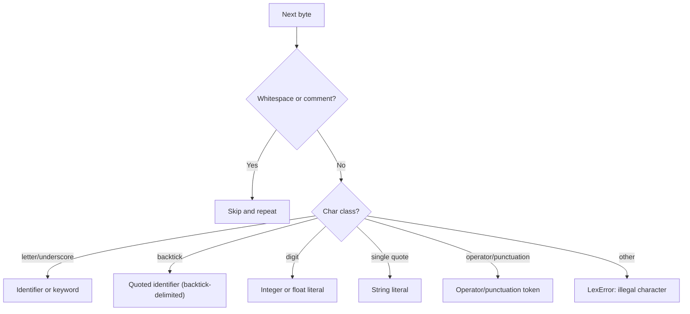
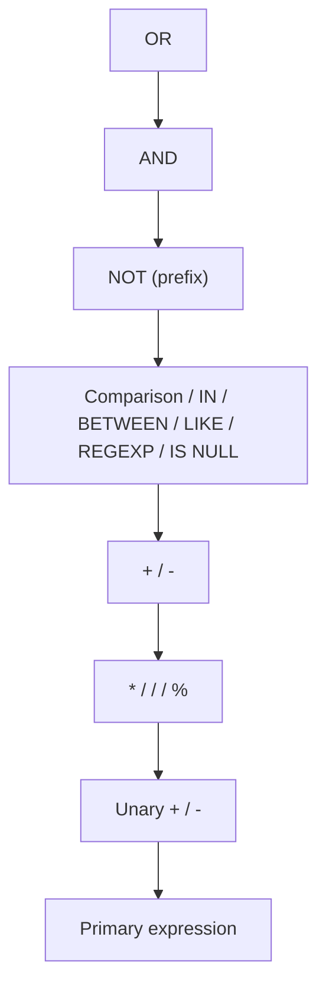
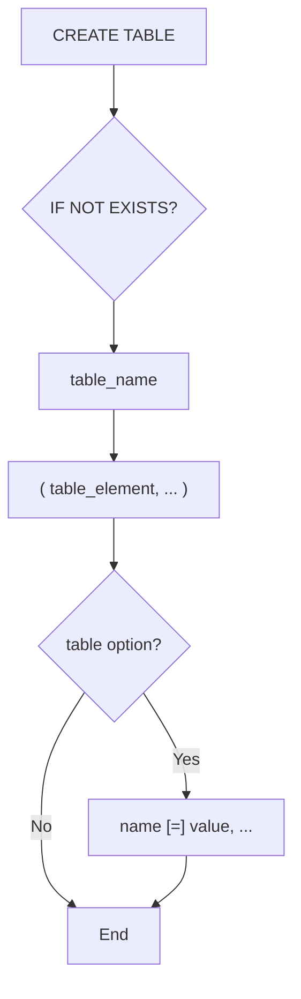
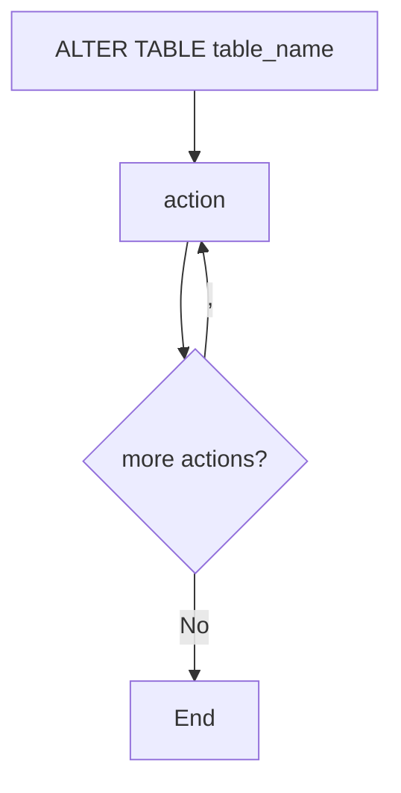

# In-House SQL Parser Specification

Defines the specification for the custom MySQL lexer/parser being built in
`internal/sqlfmt/sqlast/` and `internal/sqlfmt/parser/`.

## Motivation and Status

The formatter used to parse SQL with the [Vitess](https://vitess.io/) SQL
parser (`vitess.io/vitess/go/vt/sqlparser`), which pulled in 223 transitive
dependencies for a narrow surface area (parse + ~61 AST node types +
`String()` fallback). [Issue #20](https://github.com/Eagle-Konbu/sanat/issues/20)
tracked replacing it with a lexer/parser scoped to the MySQL features the
formatter actually needs.

**Current status**: complete. `internal/sqlfmt/formatter.go` now parses and
formats exclusively through this package, and the Vitess dependency has been
removed from `go.mod`.

| Stage | Package/File | Issue | Status |
|-------|-------------|-------|--------|
| AST node types | `internal/sqlfmt/sqlast/` | #21 | Done |
| Lexer (tokenizer) | `internal/sqlfmt/parser/lexer.go`, `token.go` | #22 | Done |
| Expression parser | `internal/sqlfmt/parser/expr.go`, `funcs.go` | #23 | Done |
| SELECT statement parser | `internal/sqlfmt/parser/select.go` | #24 | Done |
| INSERT statement parser | `internal/sqlfmt/parser/insert.go` | #25 | Done |
| UPDATE statement parser | `internal/sqlfmt/parser/update.go` | #26 | Done |
| DELETE statement parser | `internal/sqlfmt/parser/delete.go` | #27 | Done |
| UNION statement parser | `internal/sqlfmt/parser/union.go` | #28 | Done |
| Migrate formatter to custom AST | `internal/sqlfmt/formatter.go` | #29 | Done |
| Remove Vitess dependency | `go.mod` | #30 | Done |
| DDL statement parsing (CREATE/ALTER/DROP TABLE, CREATE/DROP INDEX, TRUNCATE TABLE) | `internal/sqlfmt/sqlast/ddl.go`, `internal/sqlfmt/parser/ddl.go` | #32 | Done |

Scope is MySQL DML (SELECT/INSERT/UPDATE/DELETE/UNION) plus the expression
features above, and the DDL statement kinds in
[#32](https://github.com/Eagle-Konbu/sanat/issues/32) (see
[DDL Statement Grammar](#ddl-statement-grammar) below); transaction and admin
statements remain out of scope, tracked separately in
[#38](https://github.com/Eagle-Konbu/sanat/issues/38)'s remaining sub-issues
(#33, #34). A set of minor/advanced expression and query-modifier features
(e.g. `SOUNDS LIKE`, `COLLATE` on expressions, `INTERVAL`, `MATCH ... AGAINST`,
`BINARY` cast, `ANY`/`SOME`/`ALL` subquery modifiers, `SQL_CALC_FOUND_ROWS`)
is deliberately deferred; see [#14](https://github.com/Eagle-Konbu/sanat/issues/14).

## Package Layout

```text
internal/sqlfmt/
├── sqlast/   AST node types + String() fallback serialization (no parsing logic)
└── parser/   Lexer + recursive-descent parser producing sqlast nodes
```

`sqlast` has no dependency on `parser` — `parser` depends on `sqlast`, not
the other way around, avoiding an import cycle. `internal/sqlfmt/formatter.go`
does import `parser` (it calls `parser.ParseStatement` to turn SQL text into
an AST); it's `sqlast` specifically, not the formatter, that has no parser
dependency.

## AST (`sqlast`)

Every node implements `SQLNode` (`String() string`). Sealed marker
interfaces (`Statement`, `Expr`, `TableExpr`, `SelectExpr`,
`SimpleTableExpr`, `InsertRows`) restrict which package can implement them —
their marker methods (`iExpr()`, `iStatement()`, ...) are gathered in
`markers.go`.

| Category | Types |
|----------|-------|
| Statements | `Select`, `Insert`, `Update`, `Delete`, `Union`, `With`, `CommonTableExpr`, `CreateTable`, `AlterTable`, `CreateIndex`, `DropIndex`, `DropTable`, `TruncateTable` |
| Table expressions | `AliasedTableExpr`, `JoinTableExpr`, `ParenTableExpr`, `DerivedTable` |
| Select expressions | `AliasedExpr`, `StarExpr` |
| Expressions | `ComparisonExpr`, `RangeCond`, `IsExpr`, `ArithmeticExpr`, `UnaryExpr`, `AndExpr`, `OrExpr`, `NotExpr`, `CaseExpr`, `ExistsExpr`, `Subquery`, `ColName`, `Literal`, `FuncExpr`, `ParenExpr`, `ValTuple` |
| Clauses | `Where`, `GroupBy`, `Order`/`OrderBy`, `Limit`, `JoinCondition`, `IndexHint`(s), `UpdateExpr`, `OverClause`, `WindowSpecification`, `FrameClause`, `FramePoint`, `NullTreatmentClause`, `FromFirstLastClause` |
| Aggregate/window functions | `Count`, `CountStar`, `Sum`, `Avg`, `Min`, `Max`, `BitAnd`, `BitOr`, `BitXor`, `Std`, `StdDev`, `StdPop`, `StdSamp`, `Variance`, `VarPop`, `VarSamp`, `ArgumentLessWindowExpr` (ROW_NUMBER/RANK/DENSE_RANK/PERCENT_RANK/CUME_DIST), `FirstOrLastValueExpr`, `NtileExpr`, `NTHValueExpr`, `LagLeadExpr`, `JSONArrayAgg`, `JSONObjectAgg` |
| DDL: table elements | `ColumnDef`, `DataType`, `PrimaryKeyConstraint`, `UniqueConstraint`, `IndexConstraint`, `ForeignKeyConstraint`, `IndexColumn`, `ReferenceAction`, `TableOption` |
| DDL: ALTER actions | `AddColumnAction`, `AddConstraintAction`, `DropColumnAction`, `DropIndexAction`, `ModifyColumnAction`, `RenameTableAction` |
| Identifiers | `ColIdent`, `TableIdent`, `TableName`, `Columns` |

Each type only carries the fields the formatter reads — it is not a
general-purpose SQL AST. `DataType` and `TableOption` are notable exceptions
to "one dedicated node type per construct": MySQL has dozens of column types
and table options, so both are modeled generically (name + parameters, or
name + value) rather than as an enum — see
[DDL Statement Grammar](#ddl-statement-grammar).

## Lexer (`parser.Lexer`)

`Lexer.Next() (Token, error)` streams one `Token{Type, Literal, Pos}` at a
time; `Position` carries byte offset, 1-based line, and 1-based (rune)
column for error reporting. A `*LexError` is returned — never a synthetic
token — for unterminated strings/identifiers/comments and illegal
characters.



### Token Categories

| Category | Tokens |
|----------|--------|
| Identifiers/literals | `IDENT`, `QuotedIdent`, `INT` (also `0x1A`/`0b101` forms), `FLOAT`, `STRING`, `HexStr` (`x'1A'`), `BitStr` (`b'101'`) |
| Comparison operators | `EQ` (`=`), `NE` (`<>` or `!=`), `NSE` (`<=>`), `LT`, `GT`, `LE`, `GE` |
| Arithmetic operators | `PLUS`, `MINUS`, `STAR`, `SLASH`, `PERCENT` |
| Punctuation | `LPAREN`, `RPAREN`, `COMMA`, `DOT`, `COLON`, `QUESTION` |
| Keywords | See below |

Keywords are matched case-insensitively (`lookupIdent` upper-cases before
lookup) and cover clause/statement keywords (`SELECT`, `FROM`, `WHERE`,
`INSERT`, `UPDATE`, `DELETE`, `UNION`, ...), join keywords (`JOIN`, `LEFT`,
`RIGHT`, `INNER`, `OUTER`, `CROSS`, `NATURAL`, `STRAIGHT_JOIN`), logical/
predicate keywords (`AND`, `OR`, `NOT`, `IN`, `BETWEEN`, `LIKE`, `REGEXP`,
`RLIKE`, `IS`, `NULL`, `TRUE`, `FALSE`, `EXISTS`), `CASE`/`WHEN`/`THEN`/
`ELSE`/`END`, ordering/grouping (`ORDER`, `BY`, `GROUP`, `ROLLUP`, `HAVING`,
`LIMIT`, `OFFSET`, `ASC`, `DESC`), locking (`FOR`, `LOCK`, `SHARE`, `NOWAIT`,
`SKIP`, `LOCKED`, `MODE`), CTEs (`WITH`, `RECURSIVE`), window functions
(`OVER`, `PARTITION`, `ROWS`, `RANGE`, `UNBOUNDED`, `PRECEDING`, `FOLLOWING`,
`CURRENT`, `ROW`, `RESPECT`, `NULLS`, `FIRST`, `LAST`), index hints
(`USE`, `FORCE`, `IGNORE`, `INDEX`), and DDL keywords (`CREATE`, `ALTER`,
`DROP`, `TRUNCATE`, `TABLE`, `COLUMN`, `CONSTRAINT`, `PRIMARY`, `FOREIGN`,
`REFERENCES`, `UNIQUE`, `DEFAULT`, `COMMENT`, `ENGINE`, `CHARACTER`,
`CHARSET`, `COLLATE`, `UNSIGNED`, `ZEROFILL`, `RENAME`, `TO`, `ADD`,
`MODIFY`, `CASCADE`, `RESTRICT`, `NO`, `ACTION`, `IF`, `AUTO_INCREMENT`).

### Literal Handling

- **Identifiers**: unquoted (`users`, `id`) or backtick-quoted
  (`` `users` ``, with doubled-backtick `` `` `` escaping for a literal
  backtick).
- **Numbers**: integers and floats, including exponents (`1.5e10`), plus
  MySQL's `0x1A` hex and `0b101` binary integer forms. Per MySQL, the `x`/`b`
  must be lowercase in this notation — `0X1A`/`0B101` are not recognized as
  prefixed literals (the leading `0` is lexed as a plain `INT` and the rest
  as a separate identifier).
- **Strings**: single-quoted, with backslash escapes (`\n`, `\r`, `\0`,
  `\Z`, `\\`, `\'`) and MySQL's doubled-quote (`''`) escaping. `\%` and
  `\_` are left un-decoded by the lexer (and re-escaped as-is by the
  parser's `escapeStringLiteral`) since they are only meaningful inside a
  `LIKE` pattern. `x'1A'`/`X'1A'` (hex) and `b'101'`/`B'101'` (bit) string
  literals are also recognized; the quote must immediately follow the
  `x`/`b` letter with no space, which is how the lexer tells them apart
  from a plain identifier named `x`/`b`. Unlike the `0x`/`0b` integer forms,
  the letter's case doesn't matter here. Hex string content must consist of
  hex digits with an even number of digits (`x''` is valid); bit string
  content must consist of only `0`/`1` digits.
- **Comments**: `--` and `#` line comments and `/* ... */` block comments
  are skipped like whitespace.

## Parser (`parser.Parser`)

### Entry Points

```go
func ParseExpr(input string) (sqlast.Expr, error)
func ParseSelect(input string) (*sqlast.Select, error)
func ParseInsert(input string) (*sqlast.Insert, error)
func ParseUpdate(input string) (*sqlast.Update, error)
func ParseDelete(input string) (*sqlast.Delete, error)
func ParseUnion(input string) (*sqlast.Union, error)
func ParseCreateTable(input string) (*sqlast.CreateTable, error)
func ParseAlterTable(input string) (*sqlast.AlterTable, error)
func ParseCreateIndex(input string) (*sqlast.CreateIndex, error)
func ParseDropIndex(input string) (*sqlast.DropIndex, error)
func ParseDropTable(input string) (*sqlast.DropTable, error)
func ParseTruncateTable(input string) (*sqlast.TruncateTable, error)
func ParseStatement(input string) (sqlast.Statement, error)
```

All fully consume `input`, failing with `*ParseError` if trailing tokens
remain after the expression/statement. `ParseSelect`, `ParseUpdate`, and
`ParseDelete` each accept an optional leading `WITH` clause; `ParseUnion`
does too, but fails if the input turns out to be a single `SELECT` with no
`UNION` (use `ParseSelect` for that case). None of the DDL entry points
accept a `WITH` clause — MySQL doesn't allow one before any DDL statement.
`ParseStatement` is the formatter's entry point: it dispatches on the
statement's leading keyword (after consuming an optional `WITH`) to
whichever of `SELECT`/`INSERT`/`REPLACE`/`UPDATE`/`DELETE`/`UNION`/`CREATE`/
`ALTER`/`DROP`/`TRUNCATE` parsing applies — `REPLACE` routes
through the same `parseInsertStatement` as `INSERT` (it becomes an
`*sqlast.Insert` with `Action: ReplaceAct`), and `WITH` is not accepted
before `INSERT`/`REPLACE`, matching MySQL.

### Error Handling Model

The parser is a hand-written recursive-descent parser. Internal `parseXxx`
methods return `sqlast` nodes directly (not `(T, error)`), because a syntax
error can only occur deep inside a chain of mutually recursive productions
where threading `error` through every call would bury the grammar under
`if err != nil { return nil, err }`. Instead:

- `p.failf(...)` / a lexer failure **panics** with a `*ParseError` /
  `*LexError`.
- The top-level `ParseExpr`/`ParseSelect` entry points `defer` a
  `recoverParseError`, which recovers exactly those two panic types into the
  returned `error` and re-panics anything else (a real bug).

`Parser` keeps a 3-token lookahead buffer (`tok`, `peekTok`, `peek2Tok`),
needed to disambiguate constructs like `table.*` vs. a qualified column
reference.

### Expression Grammar

`parseExpr` descends through precedence levels from loosest to tightest
binding:



Primary expressions: literals (`INT` (also `0x1A`/`0b101`), `FLOAT`,
`STRING`, `HexStr` (`x'1A'`), `BitStr` (`b'101'`), `NULL`, `TRUE`, `FALSE`),
`?` placeholders, `:name`/`:1` colon placeholders, parenthesized expressions
and scalar subqueries `(SELECT ...)`, `CASE` (searched and simple forms),
`EXISTS (SELECT ...)`, column references (`col`, `table.col`), and function
calls. Every parenthesized subquery position — scalar/`IN` subqueries,
`EXISTS`, derived tables, and CTE bodies — accepts a `UNION` of `SELECT`
branches, not just a single `SELECT`, via the shared
`parseSubqueryStatement` helper.

`[NOT] IN (...)` accepts either a subquery or a value list (`ValTuple`).
`BETWEEN ... AND ...`, `[NOT] LIKE`, and `[NOT] REGEXP`/`[NOT] RLIKE`
(`RLIKE` is a synonym parsed to the same `RegexpOp`/`NotRegexpOp` node) bind
at the same predicate level as comparison operators, alongside the
null-safe `<=>` operator. A `NOT` immediately followed by
`IN`/`BETWEEN`/`LIKE`/`REGEXP`/`RLIKE` is treated as negating that predicate
rather than as a prefix logical NOT.

### Function Calls

`parseFuncCall` dispatches by upper-cased function name to a specific
`sqlast` node:

- **`COUNT`**: `COUNT(*)` → `CountStar`; `COUNT([DISTINCT] expr, ...)` →
  `Count`.
- **Distinct-capable aggregates** (`SUM`, `AVG`, `MIN`, `MAX`): single arg,
  optional `DISTINCT`.
- **Simple aggregates** (`BIT_AND`, `BIT_OR`, `BIT_XOR`, `STD`, `STDDEV`,
  `STDDEV_POP`, `STDDEV_SAMP`, `VARIANCE`, `VAR_POP`, `VAR_SAMP`,
  `JSON_ARRAYAGG`): single arg, no `DISTINCT`.
- **Argument-less window functions** (`ROW_NUMBER`, `RANK`, `DENSE_RANK`,
  `PERCENT_RANK`, `CUME_DIST`): no arguments.
- **`FIRST_VALUE`/`LAST_VALUE`**, **`NTILE`**, **`NTH_VALUE`**,
  **`LAG`/`LEAD`**: dedicated argument shapes, each accepting an optional
  `[RESPECT|IGNORE] NULLS` clause (and `NTH_VALUE` an optional
  `FROM FIRST|LAST`).
- **`JSON_OBJECTAGG`**: `(key, value)` pair.
- **`VALUES`**: the deprecated `VALUES(col)` form used inside an `INSERT ...
  ON DUPLICATE KEY UPDATE` clause to reference the value that would have
  been inserted. `VALUES` is a keyword everywhere else in the grammar
  (it starts the `INSERT ... VALUES (...)` row list), but is accepted as a
  function name here and parsed like a generic `FuncExpr`.
- Anything else falls back to a generic `FuncExpr(name, args...)`.

All aggregate/window forms accept a trailing `OVER (window_spec)` or
`OVER window_name` clause. A window specification supports
`PARTITION BY`, `ORDER BY`, and a frame clause
(`ROWS`/`RANGE` [`BETWEEN` ... `AND` ...] with `CURRENT ROW`,
`UNBOUNDED PRECEDING/FOLLOWING`, or `expr PRECEDING/FOLLOWING` frame
points).

### SELECT Statement Grammar

```mermaid
flowchart TD
    W0{WITH?} -- Yes --> CTE["WITH [RECURSIVE] cte [(cols)] AS (subquery), ..."]
    W0 -- No --> S[SELECT]
    CTE --> S
    S --> D{DISTINCT / ALL?}
    D --> SE["SelectExprs: expr [[AS] alias] | * | table.*"]
    SE --> F{FROM?}
    F -- Yes --> FE["TableReference, ... (with JOINs)"]
    F -- No --> WH
    FE --> WH{WHERE?}
    WH -- Yes --> WE[WHERE expr]
    WH -- No --> G
    WE --> G{GROUP BY?}
    G -- Yes --> GE["GROUP BY expr, ... [WITH ROLLUP]"]
    G -- No --> H
    GE --> H{HAVING?}
    H -- Yes --> HE[HAVING expr]
    H -- No --> O
    HE --> O{ORDER BY?}
    O -- Yes --> OE[ORDER BY expr [ASC|DESC], ...]
    O -- No --> L
    OE --> L{LIMIT?}
    L -- Yes --> LE["LIMIT count [OFFSET n] | LIMIT n, count"]
    L -- No --> LK
    LE --> LK{Lock?}
    LK -- Yes --> LKE["FOR UPDATE/SHARE [NOWAIT|SKIP LOCKED] or LOCK IN SHARE MODE"]
    LK -- No --> END[End]
    LKE --> END
```

**Table references** support comma-joined tables, `JOIN` variants (plain
`JOIN`/`INNER JOIN`, `LEFT [OUTER] JOIN`, `RIGHT [OUTER] JOIN`,
`CROSS JOIN`, `NATURAL [LEFT|RIGHT] JOIN`, `STRAIGHT_JOIN`) with an optional
`ON` condition, parenthesized table lists, derived tables
(`(SELECT ...) alias`), and index hints (`USE`/`FORCE`/`IGNORE INDEX`, each
with an optional `FOR JOIN|GROUP BY|ORDER BY`).

`LIMIT` accepts either `LIMIT row_count [OFFSET offset]` or the older
`LIMIT offset, row_count` comma form; both are normalized into the same
`sqlast.Limit{Rowcount, Offset}` shape, so `String()` always renders the
`OFFSET` form regardless of which syntax was parsed.

`UPDATE`/`DELETE` share `parseTableReferenceList`/`parseOptionalOrderBy`/
`parseOptionalLimit` with `SELECT`, but MySQL only allows a trailing
`ORDER BY`/`LIMIT` on the single-table form of each (exactly one table
reference with no `JOIN`); both `parseUpdateStatement` and
`parseDeleteStatement` gate those clauses on that check so the multi-table
forms reject them as trailing tokens instead of silently accepting invalid
SQL.

Not yet implemented (grammar recognized by `sqlast` but no parser support,
or entirely out of scope): `SQL_CALC_FOUND_ROWS`/`SQL_NO_CACHE`/
`HIGH_PRIORITY`/`STRAIGHT_JOIN` SELECT modifiers, `ANY`/`SOME`/`ALL`
subquery predicates (tracked in #14).

## DDL Statement Grammar

Six statement kinds, implemented in `internal/sqlfmt/parser/ddl.go`:
`CREATE TABLE`, `ALTER TABLE`, `CREATE [UNIQUE] INDEX`, `DROP INDEX`,
`DROP TABLE`, and `TRUNCATE [TABLE]`. `ParseStatement` dispatches to these
the same way it dispatches DML: on the leading keyword, via
`parseCreateStatement`/`parseDropStatement` sub-dispatching CREATE/DROP's
second keyword (`TABLE` vs. `INDEX`/`UNIQUE`) with one token of lookahead
(`peekAt`).

### CREATE TABLE



Each `table_element` is either a column definition or a table-level
constraint, disambiguated by `isTableConstraintStart` peeking at the leading
token (`CONSTRAINT`/`PRIMARY`/`UNIQUE`/`INDEX`/`KEY`/`FOREIGN` start a
constraint; anything else starts a column).

**Column definitions** (`ColumnDef`): `name data_type [constraints...]`,
constraints accepted in any order via a loop
(`parseColumnConstraints`) until none match — `[NOT] NULL`,
`DEFAULT <expr>`, `AUTO_INCREMENT`, `ON UPDATE <expr>` (for
`TIMESTAMP`/`DATETIME` auto-update), inline `[PRIMARY] KEY`/`UNIQUE [KEY]`,
and `COMMENT <expr>`. `DEFAULT`'s and `COMMENT`'s values reuse the full
expression grammar (`parseExpr`) rather than a bespoke literal-only parser —
this also means MySQL 8.0.13+'s `DEFAULT (expr)` expression-default form
parses for free, since `(expr)` is already a valid primary expression.

**Data types** (`DataType`) are parsed generically — `parseDataType` reads a
name (`readTypeName`, which special-cases MySQL's `SET` type since it
collides lexically with the `SET` keyword), an optional parenthesized
parameter list (`parseTypeParams`, accepting `INT`/`STRING` tokens — covers
`VARCHAR(255)`, `DECIMAL(10, 2)`, and `ENUM('a', 'b')` alike), then loops
over `UNSIGNED`/`ZEROFILL`/`CHARACTER SET name`/`CHARSET name`/
`COLLATE name` modifiers in any order. There's no enum of recognized type
names — any identifier is accepted, so new MySQL types don't need parser
changes. Unlike clause keywords, a type name's source casing is preserved
verbatim (not canonicalized), the same treatment `parseGenericFuncCall`
already gives an unrecognized function name.

**Table-level constraints** (`parseTableConstraint`): a plain
`INDEX`/`KEY name (cols)` is checked first, since MySQL doesn't allow a
`CONSTRAINT` symbol on it; everything else optionally starts with
`CONSTRAINT [symbol]` and must then be `PRIMARY KEY (cols)`,
`UNIQUE [INDEX|KEY] [name] (cols)`, or
`FOREIGN KEY [name] (cols) REFERENCES table (cols) [ON DELETE action] [ON UPDATE action]`.
Referential actions (`ReferenceAction`) are `CASCADE`, `RESTRICT`,
`SET NULL`, `SET DEFAULT`, `NO ACTION`. `PRIMARY KEY`/`UNIQUE`/`INDEX`'s
column lists use the richer `IndexColumn` shape (`parseIndexColumnList`) —
each column accepts an optional prefix length (`col(20)`, required for
indexing `TEXT`/`BLOB` columns) and `ASC`/`DESC` (canonicalized to omitting
`ASC`, MySQL's default); `FOREIGN KEY`'s local and referenced column lists
are plain `Columns` instead, since MySQL doesn't accept prefix/direction
there.

**Table options** (`TableOption{Name, Value}`) are parsed generically too:
`parseTableOptionName` recognizes the common names explicitly (`ENGINE`,
`DEFAULT CHARACTER SET`/`CHARSET`/`COLLATE`, bare `CHARACTER SET`/`CHARSET`/
`COLLATE`, `COMMENT`, `AUTO_INCREMENT`) and falls back to a single bare
identifier for anything else (`ROW_FORMAT`, `MAX_ROWS`, ...), so uncommon
options round-trip without the parser needing to know about them by name.
The `=` between name and value is always optional on input and always
rendered on output. `parseTableOptions` loops until `EOF`, since table
options are always the last thing in a `CREATE TABLE` statement — this
means trailing garbage after a valid `CREATE TABLE` is often absorbed as a
(malformed) option and fails inside `parseTableOption` rather than at
`ParseStatement`'s trailing-token check.

### ALTER TABLE



Exactly seven action forms are supported (`parseAlterAction`/
`parseAddAction`/`parseDropAction`), matching MySQL's comma-separated
multi-action grammar:

| Action | AST type |
|--------|----------|
| `ADD [COLUMN] col_def` | `AddColumnAction` |
| `DROP [COLUMN] col_name` | `DropColumnAction` |
| `MODIFY [COLUMN] col_def` | `ModifyColumnAction` |
| `ADD INDEX/CONSTRAINT/PRIMARY KEY/UNIQUE/FOREIGN KEY ...` | `AddConstraintAction` (wraps a `TableConstraint`) |
| `DROP INDEX`/`DROP KEY name` | `DropIndexAction` |
| `RENAME TO new_name` | `RenameTableAction` |

`ADD`'s constraint-adding forms all reuse `parseTableConstraint` (the same
production `CREATE TABLE` uses), wrapped in a single `AddConstraintAction`
— there's no separate AST type per constraint kind, since `TableConstraint`
already models that variation. Not yet implemented: `CHANGE COLUMN`,
`RENAME COLUMN`, `DROP PRIMARY KEY`, `DROP FOREIGN KEY` — these fail to
parse like any other unsupported construct (see below), deferred in the
same spirit as #14's deferred SELECT features.

### CREATE INDEX / DROP INDEX / DROP TABLE / TRUNCATE TABLE

- `CREATE [UNIQUE] INDEX name ON table (index_columns)` — the same
  `IndexColumn` list as a table-level `INDEX` constraint.
- `DROP INDEX name ON table`.
- `DROP TABLE [IF EXISTS] table, ...` — accepts multiple comma-separated
  tables, matching MySQL's grammar.
- `TRUNCATE [TABLE] table`.

### Error Handling

DDL parsing follows the same whole-statement model as every other
statement type in this package: there is no partial or best-effort
recognition inside a `CREATE TABLE`/`ALTER TABLE` statement. A column
constraint, table option, or `ALTER` action outside the grammar above is a
`*ParseError`, which propagates up through `ParseStatement` and causes the
formatter to leave the original source string unchanged (see
[formatter-spec.md](formatter-spec.md)) — the same fallback every DML parse
failure already gets.

## Testing

`sqlast` has 100% test coverage; `parser` is table-driven per token
category (lexer) and per grammar production (parser), including error
paths (`*LexError`/`*ParseError` propagation) — see `lexer_test.go`,
`expr_test.go`, `select_test.go`, and `ddl_test.go`. `codecov.yml` excludes
`sqlast/markers.go`, whose marker methods are intentionally empty (see the
comment at the top of that file).

## Relationship to the Formatter

`internal/sqlfmt/formatter.go` parses via `parser.ParseStatement` and walks
the resulting `sqlast.Statement` directly — there is no intermediate or
fallback representation, and no Vitess dependency remains in the module.
`detect.go`'s `MightBeSQL` heuristic is unrelated to this package: it is a
cheap prefix/keyword check used to decide whether a string is worth handing
to the parser at all, not a parser itself. See
[formatter-spec.md](formatter-spec.md) for how the formatter renders each
AST node.
