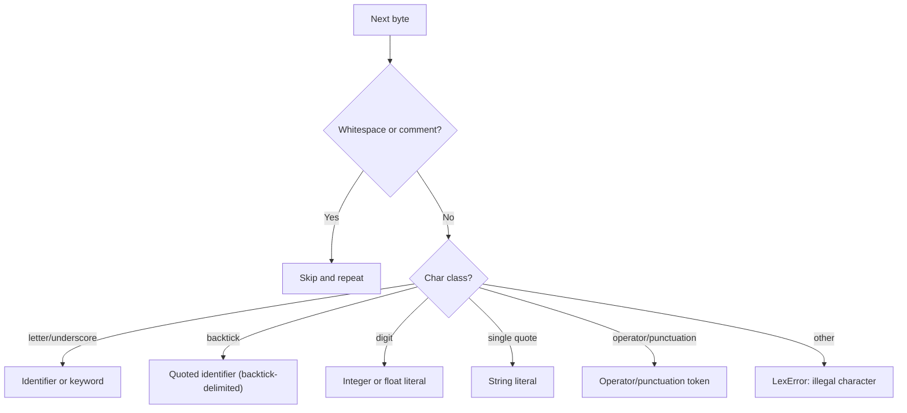
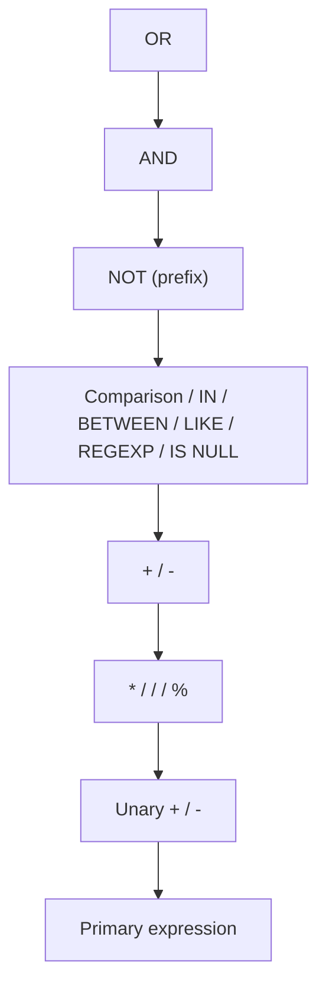

# In-House SQL Parser Specification

Defines the specification for the custom MySQL lexer/parser being built in
`internal/sqlfmt/sqlast/` and `internal/sqlfmt/parser/`.

## Motivation and Status

The formatter currently parses SQL with the [Vitess](https://vitess.io/) SQL
parser (`vitess.io/vitess/go/vt/sqlparser`), which pulls in 223 transitive
dependencies for a narrow surface area (parse + ~61 AST node types +
`String()` fallback). [Issue #20](https://github.com/Eagle-Konbu/sanat/issues/20)
tracks replacing it with a lexer/parser scoped to the MySQL features the
formatter actually needs.

**Current status**: the AST types, lexer, and expression/SELECT parser exist
and are fully tested, but `internal/sqlfmt/formatter.go` and `detect.go` are
still Vitess-based — this package is not yet wired into the formatter.

| Stage | Package/File | Issue | Status |
|-------|-------------|-------|--------|
| AST node types | `internal/sqlfmt/sqlast/` | #21 | Done |
| Lexer (tokenizer) | `internal/sqlfmt/parser/lexer.go`, `token.go` | #22 | Done |
| Expression parser | `internal/sqlfmt/parser/expr.go`, `funcs.go` | #23 | Done |
| SELECT statement parser | `internal/sqlfmt/parser/select.go` | #24 | Done |
| INSERT statement parser | — | #25 | Not started |
| UPDATE statement parser | — | #26 | Not started |
| DELETE statement parser | — | #27 | Not started |
| UNION statement parser | — | #28 | Not started |
| Migrate formatter to custom AST | `internal/sqlfmt/formatter.go` | #29 | Not started |
| Remove Vitess dependency | `go.mod` | #30 | Not started |

Scope is MySQL DML (SELECT/INSERT/UPDATE/DELETE/UNION) plus the expression
features above; DDL, transaction, and admin statements are out of scope here
and tracked separately in [#38](https://github.com/Eagle-Konbu/sanat/issues/38).
A set of minor/advanced expression and query-modifier features (e.g.
`SOUNDS LIKE`, `COLLATE`, `INTERVAL`, `MATCH ... AGAINST`, `BINARY` cast,
`ANY`/`SOME`/`ALL` subquery modifiers, `SQL_CALC_FOUND_ROWS`) is deliberately
deferred; see [#14](https://github.com/Eagle-Konbu/sanat/issues/14).

## Package Layout

```text
internal/sqlfmt/
├── sqlast/   AST node types + String() fallback serialization (no parsing logic)
└── parser/   Lexer + recursive-descent parser producing sqlast nodes
```

`sqlast` has no dependency on `parser`, so it can also be produced by the
formatter migration work in #29 without a parser dependency.

## AST (`sqlast`)

Every node implements `SQLNode` (`String() string`). Sealed marker
interfaces (`Statement`, `Expr`, `TableExpr`, `SelectExpr`,
`SimpleTableExpr`, `InsertRows`) restrict which package can implement them —
their marker methods (`iExpr()`, `iStatement()`, ...) are gathered in
`markers.go`.

| Category | Types |
|----------|-------|
| Statements | `Select`, `Insert`, `Update`, `Delete`, `Union`, `With`, `CommonTableExpr` |
| Table expressions | `AliasedTableExpr`, `JoinTableExpr`, `ParenTableExpr`, `DerivedTable` |
| Select expressions | `AliasedExpr`, `StarExpr` |
| Expressions | `ComparisonExpr`, `RangeCond`, `IsExpr`, `ArithmeticExpr`, `UnaryExpr`, `AndExpr`, `OrExpr`, `NotExpr`, `CaseExpr`, `ExistsExpr`, `Subquery`, `ColName`, `Literal`, `FuncExpr`, `ParenExpr`, `ValTuple` |
| Clauses | `Where`, `GroupBy`, `Order`/`OrderBy`, `Limit`, `JoinCondition`, `IndexHint`(s), `UpdateExpr`, `OverClause`, `WindowSpecification`, `FrameClause`, `FramePoint`, `NullTreatmentClause`, `FromFirstLastClause` |
| Aggregate/window functions | `Count`, `CountStar`, `Sum`, `Avg`, `Min`, `Max`, `BitAnd`, `BitOr`, `BitXor`, `Std`, `StdDev`, `StdPop`, `StdSamp`, `Variance`, `VarPop`, `VarSamp`, `ArgumentLessWindowExpr` (ROW_NUMBER/RANK/DENSE_RANK/PERCENT_RANK/CUME_DIST), `FirstOrLastValueExpr`, `NtileExpr`, `NTHValueExpr`, `LagLeadExpr`, `JSONArrayAgg`, `JSONObjectAgg` |
| Identifiers | `ColIdent`, `TableIdent`, `TableName`, `Columns` |

Each type only carries the fields the formatter reads — it is not a
general-purpose SQL AST.

## Lexer (`parser.Lexer`)

`Lexer.Next() (Token, error)` streams one `Token{Type, Literal, Pos}` at a
time; `Position` carries byte offset, 1-based line, and 1-based (rune)
column for error reporting. A `*LexError` is returned — never a synthetic
token — for unterminated strings/identifiers/comments and illegal
characters.



### Token Categories

| Category | Tokens |
|----------|--------|
| Identifiers/literals | `IDENT`, `QuotedIdent`, `INT` (also `0x1A`/`0b101` forms), `FLOAT`, `STRING`, `HexStr` (`x'1A'`), `BitStr` (`b'101'`) |
| Comparison operators | `EQ` (`=`), `NE` (`<>` or `!=`), `NSE` (`<=>`), `LT`, `GT`, `LE`, `GE` |
| Arithmetic operators | `PLUS`, `MINUS`, `STAR`, `SLASH`, `PERCENT` |
| Punctuation | `LPAREN`, `RPAREN`, `COMMA`, `DOT`, `COLON`, `QUESTION` |
| Keywords | See below |

Keywords are matched case-insensitively (`lookupIdent` upper-cases before
lookup) and cover clause/statement keywords (`SELECT`, `FROM`, `WHERE`,
`INSERT`, `UPDATE`, `DELETE`, `UNION`, ...), join keywords (`JOIN`, `LEFT`,
`RIGHT`, `INNER`, `OUTER`, `CROSS`, `NATURAL`, `STRAIGHT_JOIN`), logical/
predicate keywords (`AND`, `OR`, `NOT`, `IN`, `BETWEEN`, `LIKE`, `REGEXP`,
`RLIKE`, `IS`, `NULL`, `TRUE`, `FALSE`, `EXISTS`), `CASE`/`WHEN`/`THEN`/
`ELSE`/`END`, ordering/grouping (`ORDER`, `BY`, `GROUP`, `ROLLUP`, `HAVING`,
`LIMIT`, `OFFSET`, `ASC`, `DESC`), locking (`FOR`, `LOCK`, `SHARE`, `NOWAIT`,
`SKIP`, `LOCKED`, `MODE`), CTEs (`WITH`, `RECURSIVE`), window functions
(`OVER`, `PARTITION`, `ROWS`, `RANGE`, `UNBOUNDED`, `PRECEDING`, `FOLLOWING`,
`CURRENT`, `ROW`, `RESPECT`, `NULLS`, `FIRST`, `LAST`), and index hints
(`USE`, `FORCE`, `IGNORE`, `INDEX`).

### Literal Handling

- **Identifiers**: unquoted (`users`, `id`) or backtick-quoted
  (`` `users` ``, with doubled-backtick `` `` `` escaping for a literal
  backtick).
- **Numbers**: integers and floats, including exponents (`1.5e10`), plus
  MySQL's `0x1A`/`0X1A` hex and `0b101`/`0B101` binary integer forms.
- **Strings**: single-quoted, with backslash escapes (`\n`, `\r`, `\0`,
  `\Z`, `\\`, `\'`) and MySQL's doubled-quote (`''`) escaping. `\%` and
  `\_` are left un-decoded by the lexer (and re-escaped as-is by the
  parser's `escapeStringLiteral`) since they are only meaningful inside a
  `LIKE` pattern. `x'1A'`/`X'1A'` (hex) and `b'101'`/`B'101'` (bit) string
  literals are also recognized; the quote must immediately follow the
  `x`/`b` letter with no space, which is how the lexer tells them apart
  from a plain identifier named `x`/`b`.
- **Comments**: `--` and `#` line comments and `/* ... */` block comments
  are skipped like whitespace.

## Parser (`parser.Parser`)

### Entry Points

```go
func ParseExpr(input string) (sqlast.Expr, error)
func ParseSelect(input string) (*sqlast.Select, error)
```

Both fully consume `input`, failing with `*ParseError` if trailing tokens
remain after the expression/statement (`ParseSelect` also accepts a leading
`WITH` clause).

### Error Handling Model

The parser is a hand-written recursive-descent parser. Internal `parseXxx`
methods return `sqlast` nodes directly (not `(T, error)`), because a syntax
error can only occur deep inside a chain of mutually recursive productions
where threading `error` through every call would bury the grammar under
`if err != nil { return nil, err }`. Instead:

- `p.failf(...)` / a lexer failure **panics** with a `*ParseError` /
  `*LexError`.
- The top-level `ParseExpr`/`ParseSelect` entry points `defer` a
  `recoverParseError`, which recovers exactly those two panic types into the
  returned `error` and re-panics anything else (a real bug).

`Parser` keeps a 3-token lookahead buffer (`tok`, `peekTok`, `peek2Tok`),
needed to disambiguate constructs like `table.*` vs. a qualified column
reference.

### Expression Grammar

`parseExpr` descends through precedence levels from loosest to tightest
binding:



Primary expressions: literals (`INT` (also `0x1A`/`0b101`), `FLOAT`,
`STRING`, `HexStr` (`x'1A'`), `BitStr` (`b'101'`), `NULL`, `TRUE`, `FALSE`),
`?` placeholders, `:name`/`:1` colon placeholders, parenthesized expressions
and scalar subqueries `(SELECT ...)`, `CASE` (searched and simple forms),
`EXISTS (SELECT ...)`, column references (`col`, `table.col`), and function
calls.

`[NOT] IN (...)` accepts either a subquery or a value list (`ValTuple`).
`BETWEEN ... AND ...`, `[NOT] LIKE`, and `[NOT] REGEXP`/`[NOT] RLIKE`
(`RLIKE` is a synonym parsed to the same `RegexpOp`/`NotRegexpOp` node) bind
at the same predicate level as comparison operators, alongside the
null-safe `<=>` operator. A `NOT` immediately followed by
`IN`/`BETWEEN`/`LIKE`/`REGEXP`/`RLIKE` is treated as negating that predicate
rather than as a prefix logical NOT.

### Function Calls

`parseFuncCall` dispatches by upper-cased function name to a specific
`sqlast` node:

- **`COUNT`**: `COUNT(*)` → `CountStar`; `COUNT([DISTINCT] expr, ...)` →
  `Count`.
- **Distinct-capable aggregates** (`SUM`, `AVG`, `MIN`, `MAX`): single arg,
  optional `DISTINCT`.
- **Simple aggregates** (`BIT_AND`, `BIT_OR`, `BIT_XOR`, `STD`, `STDDEV`,
  `STDDEV_POP`, `STDDEV_SAMP`, `VARIANCE`, `VAR_POP`, `VAR_SAMP`,
  `JSON_ARRAYAGG`): single arg, no `DISTINCT`.
- **Argument-less window functions** (`ROW_NUMBER`, `RANK`, `DENSE_RANK`,
  `PERCENT_RANK`, `CUME_DIST`): no arguments.
- **`FIRST_VALUE`/`LAST_VALUE`**, **`NTILE`**, **`NTH_VALUE`**,
  **`LAG`/`LEAD`**: dedicated argument shapes, each accepting an optional
  `[RESPECT|IGNORE] NULLS` clause (and `NTH_VALUE` an optional
  `FROM FIRST|LAST`).
- **`JSON_OBJECTAGG`**: `(key, value)` pair.
- Anything else falls back to a generic `FuncExpr(name, args...)`.

All aggregate/window forms accept a trailing `OVER (window_spec)` or
`OVER window_name` clause. A window specification supports
`PARTITION BY`, `ORDER BY`, and a frame clause
(`ROWS`/`RANGE` [`BETWEEN` ... `AND` ...] with `CURRENT ROW`,
`UNBOUNDED PRECEDING/FOLLOWING`, or `expr PRECEDING/FOLLOWING` frame
points).

### SELECT Statement Grammar

```mermaid
flowchart TD
    W0{WITH?} -- Yes --> CTE["WITH [RECURSIVE] cte [(cols)] AS (subquery), ..."]
    W0 -- No --> S[SELECT]
    CTE --> S
    S --> D{DISTINCT / ALL?}
    D --> SE["SelectExprs: expr [[AS] alias] | * | table.*"]
    SE --> F{FROM?}
    F -- Yes --> FE["TableReference, ... (with JOINs)"]
    F -- No --> WH
    FE --> WH{WHERE?}
    WH -- Yes --> WE[WHERE expr]
    WH -- No --> G
    WE --> G{GROUP BY?}
    G -- Yes --> GE["GROUP BY expr, ... [WITH ROLLUP]"]
    G -- No --> H
    GE --> H{HAVING?}
    H -- Yes --> HE[HAVING expr]
    H -- No --> O
    HE --> O{ORDER BY?}
    O -- Yes --> OE[ORDER BY expr [ASC|DESC], ...]
    O -- No --> L
    OE --> L{LIMIT?}
    L -- Yes --> LE["LIMIT count [OFFSET n] | LIMIT n, count"]
    L -- No --> LK
    LE --> LK{Lock?}
    LK -- Yes --> LKE["FOR UPDATE/SHARE [NOWAIT|SKIP LOCKED] or LOCK IN SHARE MODE"]
    LK -- No --> END[End]
    LKE --> END
```

**Table references** support comma-joined tables, `JOIN` variants (plain
`JOIN`/`INNER JOIN`, `LEFT [OUTER] JOIN`, `RIGHT [OUTER] JOIN`,
`CROSS JOIN`, `NATURAL [LEFT|RIGHT] JOIN`, `STRAIGHT_JOIN`) with an optional
`ON` condition, parenthesized table lists, derived tables
(`(SELECT ...) alias`), and index hints (`USE`/`FORCE`/`IGNORE INDEX`, each
with an optional `FOR JOIN|GROUP BY|ORDER BY`).

`LIMIT` accepts either `LIMIT row_count [OFFSET offset]` or the older
`LIMIT offset, row_count` comma form; both are normalized into the same
`sqlast.Limit{Rowcount, Offset}` shape, so `String()` always renders the
`OFFSET` form regardless of which syntax was parsed.

`UPDATE`/`DELETE` share `parseTableReferenceList`/`parseOptionalOrderBy`/
`parseOptionalLimit` with `SELECT`, but MySQL only allows a trailing
`ORDER BY`/`LIMIT` on the single-table form of each (exactly one table
reference with no `JOIN`); both `parseUpdateStatement` and
`parseDeleteStatement` gate those clauses on that check so the multi-table
forms reject them as trailing tokens instead of silently accepting invalid
SQL.

Not yet implemented (grammar recognized by `sqlast` but no parser support,
or entirely out of scope): `SQL_CALC_FOUND_ROWS`/`SQL_NO_CACHE`/
`HIGH_PRIORITY`/`STRAIGHT_JOIN` SELECT modifiers, `ANY`/`SOME`/`ALL`
subquery predicates (tracked in #14).

## Testing

`sqlast` has 100% test coverage; `parser` is table-driven per token
category (lexer) and per grammar production (parser), including error
paths (`*LexError`/`*ParseError` propagation) — see `lexer_test.go`,
`expr_test.go`, and `select_test.go`. `codecov.yml` excludes
`sqlast/markers.go`, whose marker methods are intentionally empty (see the
comment at the top of that file).

## Relationship to the Formatter

`internal/sqlfmt/formatter.go` and `detect.go` do not import `sqlast` or
`parser` yet — they still parse with Vitess. See
[formatter-spec.md](formatter-spec.md) for the current (Vitess-based)
formatting behavior. Migrating the formatter onto this package is tracked
in [#29](https://github.com/Eagle-Konbu/sanat/issues/29); removing the
Vitess dependency once migration is complete is tracked in
[#30](https://github.com/Eagle-Konbu/sanat/issues/30).
